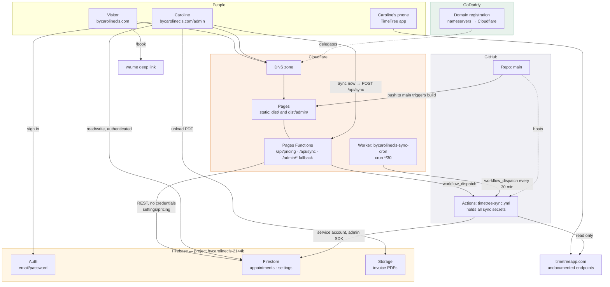
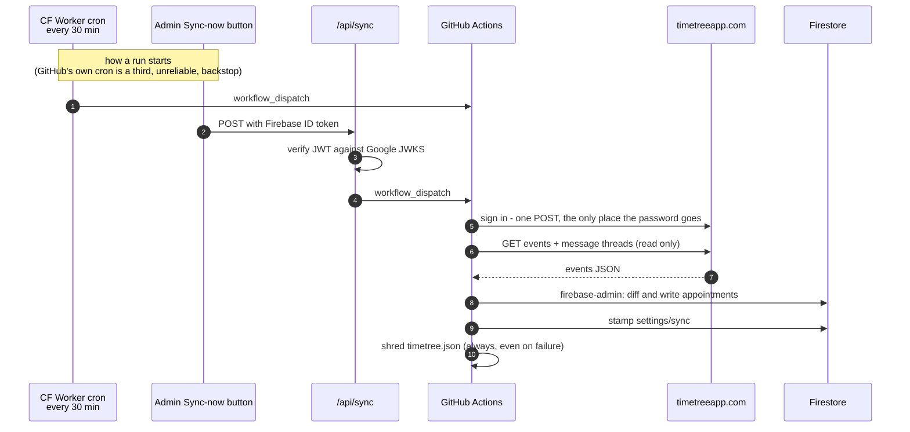

# bycarolinecls.com

Public marketing site for a hair & makeup artist in Medan, Indonesia, plus a
private admin tool for bookings, invoices and pricing.

Two separate Vue apps, one repository, one deployment.

| | |
|---|---|
| Public site | `https://bycarolinecls.com` |
| Admin | `https://bycarolinecls.com/admin` — Firebase Auth, no public signup |
| Repo | [`ZVirus1/bycarolinecls_website`](https://github.com/ZVirus1/bycarolinecls_website) (public) |
| Hosting | Cloudflare Pages + Pages Functions |
| Data | Firebase Firestore, Auth, Storage |
| Calendar source of truth | TimeTree, pulled into Firestore on a schedule |

---

## 1. The services, and what each one actually does

Five providers are involved. They each do one job, and the seams between them
are where most confusion comes from, so here they are explicitly.

| Service | What it does here | What breaks without it |
|---|---|---|
| **GoDaddy** | **Domain registrar only.** It holds the registration for `bycarolinecls.com` and is where the renewal is paid. DNS *hosting* has been delegated to Cloudflare by pointing the nameservers there. | Nothing day to day. If the registration lapses, the domain is gone. |
| **Cloudflare — DNS** | Authoritative DNS for the zone. Resolves the apex and `www` to the Pages project. | The domain stops resolving. |
| **Cloudflare — Pages** | Builds and hosts both apps. Watches `main` on GitHub, runs `npm run build`, serves `dist/`. Also terminates TLS and provides the CDN. | The whole site goes down. |
| **Cloudflare — Pages Functions** | Three small serverless endpoints living in `functions/`, deployed with the site: `/api/pricing`, `/api/sync`, and the `/admin/*` SPA fallback. | Public pricing falls back to the bundled list; the admin "Sync now" button stops; deep links into `/admin` 404. |
| **Cloudflare — Worker (`bycarolinecls-sync-cron`)** | A separate Worker, deployed by hand, whose only job is a **cron trigger every 30 minutes** that asks GitHub to run the TimeTree sync. Exists because Cloudflare honours its cron schedule and GitHub does not. | Bookings stop flowing from TimeTree until the GitHub cron happens to fire or someone hits "Sync now". |
| **Firebase — Auth** | Email/password sign-in for `/admin`. Accounts are created by hand in the console; there is no signup form. | Nobody can get into the admin. |
| **Firebase — Firestore** | The database. Bookings, invoices, the price list, the sync timestamp. | Admin and pricing both stop working. |
| **Firebase — Storage** | Holds generated invoice PDFs at `invoices/<appointmentId>.pdf`. | Invoices still generate and download in-browser, but there is no stored copy to re-open later. |
| **GitHub — repo** | Source of truth for code. Pushing to `main` is what deploys. | No deploys. |
| **GitHub — Actions** | Runs the TimeTree sync job. This is the **only** place TimeTree credentials and the Firebase service account key exist. | Bookings stop syncing. |
| **TimeTree** | Where Caroline actually manages her bookings, on her phone. Read-only from our side. | Bookings must be entered by hand in `/admin`. |
| **WhatsApp** | The public booking CTA. Not an integration — the site just builds a `wa.me` deep link with the enquiry pre-filled. | The Book page's button stops opening a useful message. |

### Two things this system deliberately is *not*

- **There is no public booking engine.** `/book` is an enquiry form that opens a
  pre-filled WhatsApp message. Nothing is written to the database from the
  public site, and the public site reads no availability data. (An earlier
  version published a `settings/availability` document; that is retired — see
  the note in `firestore.rules`.)
- **Nothing ever writes back to TimeTree.** The sync is strictly one-directional,
  TimeTree → Firestore.

---

## 2. How it all fits together



---

## 3. The four flows, one at a time

### Flow A — shipping code

```
git push origin main
   └─> Cloudflare Pages sees the commit (Git integration, no workflow file)
        └─> npm run build
             ├─ vite build (apps/site)  → dist/          [empties dist first]
             └─ vite build (apps/admin) → dist/admin/
        └─> deploy dist/ to the CDN, plus functions/ as Pages Functions
```

There is **no deploy GitHub Action**. The only workflow in `.github/` is the
TimeTree sync. Cloudflare's own Git integration does the building.

Build-time environment variables (`VITE_*`) must be set in the Cloudflare Pages
project, not in the repo — Vite inlines them into the bundle during the build.

The sync Worker is *not* part of this. It deploys separately:
`cd workers/sync-cron && npx wrangler deploy`.

### Flow B — a visitor on the public site

1. DNS resolves to Cloudflare, Pages serves `dist/index.html` and the Vue app.
2. Client-side routing handles `/portfolio`, `/about`, `/pricing`, `/book`.
3. `/pricing` renders the **bundled** service list immediately
   (`packages/shared/services.js`), then fetches `/api/pricing` and swaps in the
   live list if it comes back. The page is never empty and never blocks on the
   network.
4. `/api/pricing` reads `settings/pricing` from Firestore over the plain REST
   API with **no credentials** — that one document is world-readable on purpose.
   Cached at the edge for 5 minutes.
5. `/book` collects service, date and time client-side and builds a `wa.me`
   link. **No database write, no PII, no account.**

Setting `VITE_SITE_MODE=coming-soon` in Cloudflare swaps the whole public site
for a holding page. `/admin` is a separate build and is unaffected.

### Flow C — Caroline in `/admin`

1. `/admin` is served by `functions/admin/[[path]].js`, which serves the admin
   shell for any non-asset path. (A plain `_redirects` rule can't do this:
   `/admin/* → /admin/index.html` self-matches and Pages rejects the file as a
   loop.)
2. `LoginGate` blocks everything until Firebase Auth resolves. Sessions persist
   in local storage.
3. Once signed in, the app talks to **Firestore directly from the browser**
   using the Firebase SDK. `firestore.rules` is the actual security boundary —
   signed in means owner, because there is no signup.
4. **New invoice**: `nextInvoiceNumber()` mints `INV-YYYY-NNNN` inside a
   Firestore transaction (so two open tabs can't produce duplicates), the
   preview is rasterised with `html2canvas`, wrapped into a PDF with `jsPDF`,
   uploaded to Storage at `invoices/<id>.pdf`, and the download URL is written
   back onto the booking.
5. **Calendar**: reads `appointments`. On open, if `settings/sync.lastSyncAt` is
   more than 10 minutes old it quietly nudges a sync in the background.
6. **Pricing**: writes `settings/pricing`, which drives the invoice dropdown
   *and* the public pricing page.

### Flow D — TimeTree → Firestore sync

This is the most involved piece, and the reason for the Worker.



**Why the extra hop through a Worker.** TimeTree shut its official API down on
22 Dec 2023 and has no iCal subscription feed, so the sync must poll. The
credentials can't live in the browser or in Cloudflare, so the work happens in
GitHub Actions. But GitHub's scheduled workflows are best-effort — a `*/5` cron
on this repo delivered roughly two runs in a day. Cloudflare's Cron Triggers
keep their schedule, so a Worker fires the dispatch and GitHub does the work.
The `schedule:` block in `timetree-sync.yml` is retained purely as a backstop.

**Interval is every 30 minutes**, in both the Worker and the workflow. It was
`*/5` originally; each run now also reads a message thread per event, so `*/5`
would mean ~39,000 requests and 288 sign-ins a day against an undocumented
endpoint that rate-limits sign-ins (error `-495`). The admin calendar's
on-open nudge covers the "I just added a booking" case.

**Safety properties of the sync:**

- Read-only against TimeTree. There is no code path that writes to it.
- `hasInvoice` is never in the update payload, so a title or time change in
  TimeTree cannot orphan an invoice.
- A booking that already has an invoice is **never deleted**, even if it
  vanishes from TimeTree. The invoice is our record, not theirs.
- Only genuinely changed documents are rewritten.
- Recurring events are not expanded; only the first occurrence syncs.
- The fetched JSON contains real client names and is deleted from the runner
  after every run, including on failure.
- The window is −60 days to +400 days, so runs stay cheap.

---

## 4. Public vs admin — the boundary

They are two separate Vite builds, not one app with a route guard. That is
deliberate on two counts.

**Weight.** The admin pulls in jsPDF, html2canvas and the Firebase SDK — about
336 kB gzipped. None of that belongs on a landing page that ships 40 kB.

**Blast radius.** Admin assets land under `/admin/`, so a single path rule
covers the whole tool (`X-Robots-Tag: noindex, nofollow` in `_headers`), and the
public bundle contains no Firestore query code at all.

| | Public site | Admin |
|---|---|---|
| Build | `apps/site` → `dist/` | `apps/admin` → `dist/admin/` |
| Auth | none | Firebase Auth, hand-created accounts |
| Firestore access | none from the browser | full, via the SDK, gated by rules |
| Reads client data | **never** | yes |
| Server help | `/api/pricing` (uncredentialed) | `/api/sync` (token-verified) |

**Where client PII lives:** names, phone numbers, addresses and notes are all in
`appointments`, which `firestore.rules` makes admin-only. The public site never
reads that collection and has no code that could. The only world-readable
document in the entire database is `settings/pricing` — a price list.

`/api/sync` is the one endpoint that acts on the admin's behalf server-side, so
it re-verifies the Firebase ID token against Google's JWKS itself
(`functions/_lib/auth.js`) — checking signature, audience, issuer and expiry,
because anything the browser sends can be forged.

---

## 5. Repo layout

```
apps/site/            public site                      → dist/
  src/content/site.js   all editable copy, links, portfolio
apps/admin/           invoices, calendar, pricing      → dist/admin/
  src/stores/           firebase, auth, invoices, pricing, sync
  src/lib/ics.js        .ics parsing, shared with the sync script
packages/shared/      service menu + formatters, used by both apps
functions/            Cloudflare Pages Functions (deploy with the site)
  api/pricing.js        public price list
  api/sync.js           admin-only "sync now" trigger
  admin/[[path]].js     SPA fallback for /admin
  _lib/auth.js          Firebase ID token verification at the edge
workers/sync-cron/    separate Worker: the cron that fires the sync
scripts/
  timetree-fetch.mjs    reads TimeTree (ours, zero dependencies)
  sync-timetree.mjs     diffs that into Firestore via firebase-admin
firestore.rules       the real security boundary
storage.rules
.github/workflows/timetree-sync.yml
```

---

## 6. Data model

One collection does most of the work.

**`appointments`** — every booking, whether it came from TimeTree or was created
as an invoice. An invoice *is* an appointment with `hasInvoice: true` and a
`pdfUrl`. Keeping one record per booking means the calendar and the invoice list
can never disagree about a date.

| Field | Notes |
|---|---|
| `clientName`, `address`, `note` | client PII — admin-only, always |
| `appointmentDate` | `YYYY-MM-DD`, bucketed in `BUSINESS_TIMEZONE` (Asia/Jakarta) |
| `appointmentTime`, `appointmentEndTime` | empty for all-day events |
| `source` | `'timetree'` when the sync created it |
| `timetreeUid` | the key the sync diffs on |
| `messages[]` | the TimeTree message thread, `{id, author, text, at}` |
| `hasInvoice`, `services[]`, `subtotal`, `pdfUrl` | ours — the sync never touches these |
| `syncedAt`, `createdAt`, `updatedAt` | |

**`settings/pricing`** — the service menu. The only world-readable document.
Drives the invoice dropdown, the public pricing page and the booking form's
service list. `packages/shared/services.js` is the seed and offline fallback.

**`settings/counters`** — invoice sequence per year, incremented transactionally.

**`settings/sync`** — `lastSyncAt` plus created/updated/removed counts, so the
admin can show "Last synced" without guessing.

**Storage** — `invoices/<appointmentId>.pdf`.

---

## 7. Configuration: where every value lives

Nothing sensitive is in the repo. Which system holds which value matters, so:

### Cloudflare Pages → Settings → Environment variables (Production *and* Preview)

| Name | Purpose |
|---|---|
| `VITE_FIREBASE_API_KEY` | build-time, inlined into the bundle |
| `VITE_FIREBASE_AUTH_DOMAIN` | `bycarolinecls-2144b.firebaseapp.com` |
| `VITE_FIREBASE_PROJECT_ID` | `bycarolinecls-2144b` |
| `VITE_FIREBASE_STORAGE_BUCKET` | `bycarolinecls-2144b.firebasestorage.app` |
| `VITE_FIREBASE_MESSAGING_SENDER_ID` | |
| `VITE_FIREBASE_APP_ID` | |
| `VITE_BANK_NAME`, `VITE_BANK_ACCOUNT_NAME`, `VITE_BANK_ACCOUNT_NO` | invoice payment details — kept out of the public repo |
| `VITE_SITE_MODE` | `live`, or `coming-soon` for a holding page |
| `FIREBASE_PROJECT_ID` | runtime, for the Functions (no `VITE_` prefix) |
| `GITHUB_REPO` | `ZVirus1/bycarolinecls_website` |
| `GITHUB_SYNC_TOKEN` | fine-grained PAT, **Actions: read and write** on this repo only |
| `NODE_VERSION` | `20`, if the build complains |

> The `VITE_FIREBASE_*` values are **public by design** — Vite inlines them into
> the browser bundle no matter what. A Firebase web API key identifies the
> project; it does not grant access. `firestore.rules` is what protects the data.

### GitHub → Settings → Secrets and variables → Actions

| Secret | Purpose |
|---|---|
| `TIMETREE_EMAIL` | TimeTree login |
| `TIMETREE_PASSWORD` | sent in exactly one request, never written to disk |
| `TIMETREE_CALENDAR_ID` | `node scripts/timetree-fetch.mjs --list` to find it |
| `FIREBASE_SERVICE_ACCOUNT` | the whole service account JSON, pasted as one value |

This repo is public, but Actions secrets are encrypted, masked in logs, and not
given to pull requests from forks.

### Cloudflare Worker secret

```sh
cd workers/sync-cron
npx wrangler secret put GITHUB_SYNC_TOKEN   # same PAT as the Pages project
```

`GITHUB_REPO` is a plain var in `wrangler.jsonc`. That is the Worker's entire
blast radius: it can start one workflow in one repo, and holds no TimeTree or
Firebase credentials.

### Local

`cp .env.example .env.local`, fill in from the Firebase console. `.env.*` is
gitignored apart from the example.

---

## 8. Running locally

```sh
npm install
cp .env.example .env.local     # fill in from the Firebase console
npm run dev                    # public site  → localhost:5173
npm run dev:admin              # admin        → localhost:5174
```

The dev server proxies `/api` to `127.0.0.1:8788`, so to exercise the Functions
too, build and serve through Wrangler:

```sh
npm run build && npm run preview   # wrangler pages dev dist
```

Without that, `/pricing` just uses its bundled fallback — which is the correct
production behaviour when the endpoint is unavailable, so it is fine for most
work.

---

## 9. Editing content

- **Copy, portfolio, social links, WhatsApp number** — `apps/site/src/content/site.js`.
  You should never need to touch a component to change the site's words.
- **Photos** — drop into `apps/site/public/portfolio/`, then list them in that file.
- **Prices** — edit in `/admin → Pricing`. That one save updates the invoice
  dropdown, the public pricing page and the booking form together.
- **Bank details on invoices** — Cloudflare env vars, not the repo.

---

## 10. Operations

**Deploying:** push to `main`. See [DEPLOY.md](./DEPLOY.md) for first-time
setup — Firebase project, Pages project, DNS cutover from GoDaddy.

**Watching the sync:**

```sh
npx wrangler tail bycarolinecls-sync-cron   # silence is success; it only logs failures
```

Or check "Last synced" on the admin calendar, or the Actions tab.

**Forcing a sync:** the "Sync now" button in `/admin → Calendar`, or
**Actions → Sync TimeTree calendar → Run workflow**.

### Troubleshooting

| Symptom | Likely cause |
|---|---|
| Bookings not appearing | Check Actions for a failed run. TimeTree rate-limits sign-ins (`-495`) — raise the cron interval if so. |
| "Sync now" says not configured | `GITHUB_SYNC_TOKEN` / `GITHUB_REPO` missing on the Pages project. It returns 501 rather than pretending to work. |
| Admin login fails | The domain is not in Firebase → Authentication → Settings → **Authorized domains**. Needs `bycarolinecls.com`, `www.`, and the `.pages.dev`. |
| `/pricing` shows stale prices | `/api/pricing` is edge-cached for 5 minutes. |
| `/admin/calendar` serves the public site | The `functions/admin/[[path]].js` fallback isn't deploying. |
| Firebase throws at admin startup | Config incomplete — it fails loudly on purpose, because placeholder config once failed silently for months. |

---

## 11. Costs

| Item | Cost |
|---|---|
| Cloudflare Pages (static + 100k function requests/day) | £0 |
| Cloudflare DNS | £0 |
| Cloudflare Worker cron (~1,440 requests/day) | £0 on the free plan |
| GitHub Actions on a public repo | £0 |
| Firebase Spark (Firestore + Auth + Storage) | £0 at this volume |
| GoDaddy domain renewal | what you already pay |

Making the repo private would change this: private repos get 2,000 free Actions
minutes a month, so a 30-minute sync costs a few pounds and a 5-minute one would
cost around £100. The only other realistic path off the free tier is Firebase
Storage if PDFs pile up — Spark includes 5 GB, which is thousands of invoices.

---

## 12. Notes

- The invoice app also exists standalone at
  [ZVirus1/bycarolinecls-invoice](https://github.com/ZVirus1/bycarolinecls-invoice)
  with its own GitHub Pages deployment. That repo is untouched; its history was
  merged into `apps/admin/` here.
- Git history in *this* repo was rewritten on 2026-08-29 with `git filter-repo`
  to purge a bank account number and one client's personal details. The same
  values still exist in the standalone invoice repo, which is also public — see
  the security section of DEPLOY.md before deciding what to do about that.
- The TimeTree endpoints are undocumented and can change without notice.
  `scripts/timetree-fetch.mjs` is ~500 lines, has zero dependencies, and talks
  only to `timetreeapp.com` — so when it does break, there is no third party
  to wait on.
